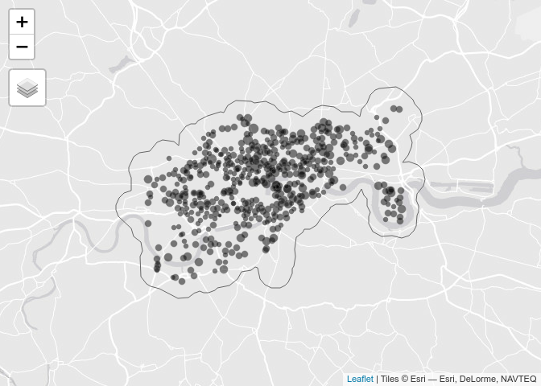

# Cycle Hire Locations in London

This repo contains reproducible code to get London cycle hire data.

We will get them using R with the following packages loaded:

``` r
library(tidyverse)
library(osmdata)
library(tmap)
tmap_mode("view")
```

## Official data

TfL’s official dataset on cycle hire locations is no longer available:
<https://data.london.gov.uk/dataset/tfl-cycle-hire-locations>

However, there was a FOI made in 2020, leading to the publication of
cycle hire location data, which can be accessed from R as follows:

``` r
u = "http://foi.tfl.gov.uk/FOI-2898-1920/FOI-2898-1920.xlsx"
f = basename(u)
download.file(u, f)
stations_tfl_2020 = readxl::read_excel(f)
stations_tfl_2020
```

    ## # A tibble: 802 x 6
    ##    Station.Id StationName                    longitude latitude Easting Northing
    ##         <dbl> <chr>                              <dbl>    <dbl>   <dbl>    <dbl>
    ##  1          1 River Street, Clerkenwell        -0.110      51.5 531203.  182832.
    ##  2          2 Phillimore Gardens, Kensington   -0.198      51.5 525207.  179392.
    ##  3          3 Christopher Street, Liverpool…   -0.0846     51.5 532985.  182002.
    ##  4          4 St. Chad's Street, King's Cro…   -0.121      51.5 530437.  182912.
    ##  5          5 Sedding Street, Sloane Square    -0.157      51.5 528052.  178742.
    ##  6          6 Broadcasting House, Marylebone   -0.144      51.5 528857.  181543.
    ##  7          7 Charlbert Street, St. John's …   -0.168      51.5 527158.  183301.
    ##  8          8 Maida Vale, Maida Vale           -0.183      51.5 526102   182780 
    ##  9          9 New Globe Walk, Bankside         -0.0964     51.5 532204.  180435.
    ## 10         10 Park Street, Bankside            -0.0928     51.5 532464.  180284.
    ## # … with 792 more rows

``` r
nrow(stations_tfl_2020)
```

    ## [1] 802

As the above code shows, that contains 802 docking stations. We believe
these are stations that are currently active.

We set the id to a character to match the OSM data:

``` r
stations_tfl_2020$official_ref = as.character(stations_tfl_2020$Station.Id)
```

We will remove the pop-up stations, which only exist for a few days, as
follows:

``` r
stations_tfl_2020 = stations_tfl_2020 %>% 
  filter(!stringr::str_detect(string = StationName, pattern = "Pop"))
```

## OSM data

The OSM community has been active in mapping many things, including
cycle hire docking stations. The following commands get this data:

``` r
stations_osm_list = opq("london") %>% 
  add_osm_feature(key = "amenity", value = "bicycle_rental") %>% 
  osmdata_sf()

stations_osm = stations_osm_list$osm_points 
stations_osm = stations_osm %>% select(osm_id, name, brand, capacity, start_date, network, official_name, official_ref)


stations_osm = stations_osm %>% 
  filter(str_detect(string = network, "tfl") | str_detect(string = brand, "antand"))
```

## Comparing TfL and OSM sources

There are 8 more stations in the official dataset. We can join the OSM
data with the official data as follows, after a few checks:

``` r
summary(duplicated(stations_osm$official_ref))
```

    ##    Mode   FALSE    TRUE 
    ## logical     781       2

``` r
summary({osm_in_official = stations_osm$official_ref %in% stations_tfl_2020$official_ref})
```

    ##    Mode   FALSE    TRUE 
    ## logical      16     767

``` r
nrow(stations_tfl_2020) - nrow(stations_osm)
```

    ## [1] 9

``` r
stations_combined = left_join(
  stations_tfl_2020,
  stations_osm %>% sf::st_drop_geometry()
  )
```

    ## Joining, by = "official_ref"

<!-- We can also add a dataset approximating the first wave of the data as follows: -->

``` r
stations_combined$capacity = as.numeric(stations_combined$capacity)
```

We need to make this combined dataset a geographic class for mapping:

``` r
# stations_sf = sf::st_as_sf(stations_combined, coords = c("longitude", "latitude"), crs = 4326)
stations_sf = sf::st_as_sf(stations_combined, coords = c("Easting", "Northing"), crs = 27700)
```

``` r
stations_area = stations_sf %>% 
  sf::st_buffer(1000) %>% 
  sf::st_union()

qtm(stations_area, fill = NULL) +
  tm_shape(stations_sf) +
  tm_dots(size = "capacity", scale = 0.3, alpha = 0.5)
```

    ## Linking to GEOS 3.8.0, GDAL 3.0.4, PROJ 7.0.0

    ## Legend for symbol sizes not available in view mode.

<!-- -->

## Updating the data

There are many ways we could improve the data. The most obvious is the
start date. If anyone has ideas on that, please let us know on the issue
tracker.

## Publishing open data

We hope to collaborate with others to improve and eventually publish
data data as open data.
